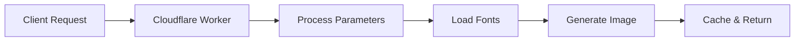

    

# Generate Dynamic OG Images using Cloudflare Workers

  

Want your social media posts to pop? Eye-catching visuals are essential, and Open Graph (OG) images are the key. These preview images are what users see when you share links on platforms like Twitter, Facebook, or LinkedIn. A compelling OG image can significantly boost engagement and drive traffic to your content.

  

In this tutorial, we'll build a fast and efficient OG image generator using Cloudflare Workers, a serverless platform that lets you run code directly at the edge of the Cloudflare network. This means your images will be generated incredibly quickly, no matter where your users are located.

  

You'll learn how to:

  

- Set up a Cloudflare Worker project.

- Implement different font loading strategies.

- Create dynamic social media cards with custom styles.

- Optimize your application with caching.

  

By the end of this tutorial, you'll have a fully functional OG image generator that you can use to enhance your social media presence.

  

GitHub repository: [og-image-generator-cloudflare-worker](https://github.com/mohdlatif/og-image-generator-cloudflare-worker)

  

## Solution Overview

  

The high-level workflow of the OG image generator you are going to build in this tutorial is the following:

  

1. A URL on your domain (for example, `your-worker.workers.dev/og?mainText=Hello&description=World&footerText=From-Cloudflare-Worker&style=1`) will be routed to a Cloudflare Worker.

  

2. The Worker will process the request parameters and determine:

      - Text content (main text, description, footer)

      - Visual style selection

      - Font configurations

  

3. The Worker will load the required fonts using one of four strategies:

  

- Google Fonts API

     - GitHub-hosted fonts

     - Direct URL fonts

     - Local font files

  

4. The Worker will generate the OG image using:

      - `@cloudflare/pages-plugin-vercel-og`, powered by Vercel's Satori library

      - Tailwind CSS for styling

      - React components for layout

  

5. Finally, the Worker will return the generated image, optimized and cached for future requests.

  

Here's a visual representation of the workflow:

  



  

### Key Benefits

  

- **Edge Computing**: Generates images at the edge using Cloudflare Workers

- **Modern Rendering**: Utilizes Vercel's Satori library for high-quality image generation

- **Flexible Styling**: Supports both Tailwind CSS and inline styles

- **Font Versatility**: Multiple font loading strategies for different use cases

- **Performance Optimized**: Built-in caching and optimization

- **Customizable**: Easy to extend with new styles and font configurations

- **Developer Friendly**: TypeScript support and modular architecture

  

## Before you begin

  

Before you start, make sure you have:

  

- A Cloudflare account. If you do not have one, [sign up](https://dash.cloudflare.com/sign-up/workers-and-pages) before continuing.

- Wrangler CLI installed (`npm install -g wrangler`)

- [Bun](https://bun.sh/) installed on your machine.

- Basic familiarity with TypeScript and React.

- A text editor or IDE of your choice.

  

:::note

  

If you haven't installed Wrangler yet, you can do so using any of these package managers:

  

```bash

  

npm install -g wrangler

  

# or

  

bun add -g wrangler

  

# or

  

yarn global add wrangler

  

# or

  

pnpm add -g wrangler

  

```

  

:::

  

## 1. Set up your development environment

  

First, create a new Cloudflare Workers project using the Hono framework:

  

<PackageManagers

  type="create"

  pkg="cloudflare@latest"

  args="og-image-generator --template cloudflare-workers --pm bun"

/>

  

Navigate to the project directory:

  

```bash

cd og-image-generator

```

  

## 2. Install required dependencies

  

Add the necessary packages to your project:

  

<Tabs> <TabItem label="bun">

  

```sh

bun add @cloudflare/pages-plugin-vercel-og autoprefixer postcss-cli react react-dom tailwindcss

bun add -d @cloudflare/workers-types @types/bun @types/react @types/react-dom @vercel/og

```

  

</TabItem> <TabItem label="npm">

  

```sh

npm install @cloudflare/pages-plugin-vercel-og autoprefixer postcss-cli react react-dom tailwindcss

npm install -d @cloudflare/workers-types @types/bun @types/react @types/react-dom @vercel/og

```

  

</TabItem> <TabItem label="yarn">

  

```sh

yarn add @cloudflare/pages-plugin-vercel-og autoprefixer postcss-cli react react-dom tailwindcss

yarn add -d @cloudflare/workers-types @types/bun @types/react @types/react-dom @vercel/og

```

  

</TabItem> <TabItem label="pnpm">

  

```sh

pnpm add @cloudflare/pages-plugin-vercel-og autoprefixer postcss-cli react react-dom tailwindcss

pnpm add -d @cloudflare/workers-types @types/bun @types/react @types/react-dom @vercel/og

```

  

</TabItem> </Tabs>

  

## 3. Configure project settings

  

### Package.json configuration

  

Update your `package.json` to include the type module and deployment scripts:

  

```json:package.json

  

{

  

  "name": "og-image-generator",

  

  "module": "index.ts",

  

  "version": "1.0.0",

  

  "type": "module",

  

  "scripts": {

  

    "dev": "wrangler dev src/index.ts",

  

    "deploy": "wrangler deploy --minify src/index.ts"

  

  }

  

}

  

```

  

The `type: "module"` field enables ES modules support, and the `--minify` flag in the deploy script ensures your worker code is optimized for production.

  

### TypeScript configuration

  

Create a `tsconfig.json` file with the following configuration:

  

```json:tsconfig.json

  

{

  

  "compilerOptions": {

  

    "target": "ESNext",

  

    "lib": ["ESNext"],

  

    "moduleDetection": "force",

  

    "jsx": "react-jsx",

  

    "module": "ESNext",

  

    "moduleResolution": "bundler",

  

    "types": [

  

      "bun-types",

  

      "hono",

  

      "@cloudflare/workers-types/2023-07-01"

  

    ],

  

    "resolveJsonModule": true,

  

    "esModuleInterop": true,

  

    "allowJs": true,

  

    "checkJs": false,

  

    "noEmit": true,

  

    "isolatedModules": true,

  

    "allowSyntheticDefaultImports": true,

  

    "forceConsistentCasingInFileNames": true,

  

    "strict": true,

  

    "skipLibCheck": true,

  

    "noFallthroughCasesInSwitch": true,

  

    "noUnusedLocals": false,

  

    "noUnusedParameters": false,

  

    "noPropertyAccessFromIndexSignature": false

  

  },

  

  "baseUrl": "./",

  

  "paths": {

  

    "@/*": ["./src/*"]

  

  }

  

}

  

```

  

Key TypeScript configuration features:

  

- React JSX support with `jsx: "react-jsx"`

- ES modules configuration with `module: "ESNext"`

- Cloudflare Workers types integration

- Path aliases for cleaner imports

- Strict type checking enabled

- Modern JavaScript features support

  

### Configure Wrangler for Runtime Compatibility and Static Assets

  

Before starting, ensure your `wrangler.toml` includes these essential configurations:

  

```toml

compatibility_flags = [ "nodejs_compat_v2" ]

assets = { directory = "public" }

```

  

The `nodejs_compat_v2` flag enables runtime compatibility features required by the OG image generation library, even when using Bun. While we're using Bun as our development runtime, this flag ensures all necessary APIs are available in the Workers environment. The `assets` configuration maps your Worker's public directory, allowing direct access to static files like fonts, images, and favicons through URL paths (e.g., `/fonts/Inter.ttf`, `/images/logo.png`).

  

## 4. Configure font loading strategies

  

The generator supports four different font loading strategies, each with its own benefits:

  

1. **Google Fonts API** (Recommended for web fonts)

  

   - Best for: Popular web fonts with dynamic text

   - Pros: Optimized delivery, wide font selection

   - Cons: Requires internet connection

  

2. **GitHub-hosted fonts** (Alternative for Google Fonts)

  

   - Best for: Stable, version-controlled fonts

   - Pros: Direct access to font files

   - Cons: Manual updates needed

  

3. **Direct URL fonts** (For custom hosted fonts)

  

   - Best for: Self-hosted or third-party fonts

   - Pros: Complete control over font sources

   - Cons: Requires hosting infrastructure

  

4. **Local font files** (For offline/private fonts)

   - Best for: Custom or licensed fonts

   - Pros: No external dependencies

   - Cons: Increases worker bundle size

  

Choose your strategy based on:

  

- Font licensing requirements

- Performance needs

- Hosting preferences

- Update frequency

  

First, create a `fonts` directory inside your `public` folder to store any local font files:

  

```bash

mkdir -p public/fonts

```

  

This directory will store any font files (like `.ttf`, `.otf`) that you want to serve directly from your Worker.

  

Create a new file for handling different font loading methods:

  

```typescript

  

---

  

filename: src/getFonts.ts

  

---

  

import type { Context } from 'hono';

  
  
  

// Define font weights and styles (matching types from getFonts.ts)

  

type Style = 'normal' | 'italic';

  

type Weight = 100 | 200 | 300 | 400 | 500 | 600 | 700 | 800 | 900;

  
  
  

type FontConfig = {

  

    path: string;

  

    weight: Weight;

  

    style?: Style;

  

};

  
  
  

/**

  

 * Fetches fonts from GitHub repository with caching support

  

 *

  

 * Used for accessing fonts stored in Google Fonts' GitHub repository.

  

 * Currently configured for Inria Sans Regular and Bold variants.

  

 *

  

 * @returns Promise<Array> of font objects, each containing:

  

 *          - data: ArrayBuffer of the font file

  

 *          - name: Font family name

  

 *          - style: The font's style ('normal' or 'italic')

  

 *          - weight: The font's weight (500 or 700)

  

 *

  

 * @throws Error if any font fails to fetch from GitHub

  

 *

  

 * @example

  

 * const fonts = await githubFonts();

  

 *

  

 */

  

export const githubFonts = async () => {

  

    const base = 'https://raw.githubusercontent.com/google/fonts/main/ofl/inriasans/';

  
  
  

    // Define font files to fetch with their properties

  

    const list = [

  

        ['InriaSans-Regular.ttf', 'Inria Sans', 500, 'normal' as Style] as const,

  

        ['InriaSans-Bold.ttf', 'Inria Sans', 700, 'normal' as Style] as const,

  

    ];

  
  
  

    // Map each font definition to a fetch promise with caching

  

    const fonts = list.map(async ([file, name, weight, style]) => {

  

        const url = `${base}${file}`;

  

        const cache = caches.default;

  

        const cacheKey = url;

  

        const res = await cache.match(cacheKey);

  

        if (res) {

  

            const data = await res.arrayBuffer();

  

            return { data, name, style, weight };

  

        } else {

  

            const res = await fetch(url);

  

            const data = await res.arrayBuffer();

  

            await cache.put(cacheKey, new Response(data, { status: 200 }));

  

            return { data, name, style, weight };

  

        }

  

    });

  
  
  

    return Promise.all(fonts);

  

};

  
  
  

/**

  

 * Fetches a font from Google Fonts API with specific text, weight, and style

  

 *

  

 * This function:

  

 * 1. Constructs a Google Fonts API URL with the specified parameters

  

 * 2. Fetches the CSS containing the font URL

  

 * 3. Extracts and fetches the actual font file

  

 * 4. Returns the font data in a format compatible with Vercel OG Image

  

 *

  

 * @param text - The text to be rendered (affects font subset optimization)

  

 * @param font - The name of the font family (e.g., "Roboto", "Open Sans")

  

 * @param weight - Font weight (100-900), defaults to 400

  

 * @param style - Font style ('normal' or 'italic'), defaults to 'normal'

  

 *

  

 * @returns Promise containing font object with:

  

 *          - data: ArrayBuffer of the font file

  

 *          - name: Font family name

  

 *          - style: The font's style

  

 *          - weight: The font's weight

  

 *

  

 * @throws Error if the font fails to fetch or if the CSS parsing fails

  

 *

  

 * @example

  

 * const font = await googleFont(

  

 *   'Hello World',

  

 *   'Roboto',

  

 *   700,

  

 *   'italic'

  

 * );

  

 *

  

 */

  

export async function googleFont(

  

    text: string,

  

    font: string,

  

    weight: Weight = 400,

  

    style: Style = 'normal'

  

): Promise<{ data: ArrayBuffer; name: string; style: Style; weight: Weight }> {

  

    const fontFamilyFetchName = font.replace(/ /g, '+');

  

    const API = `https://fonts.googleapis.com/css2?family=${fontFamilyFetchName}:ital,wght@${

  

        style === 'italic' ? '1' : '0'

  

    },${weight}&text=${encodeURIComponent(text)}`;

  
  
  

    const css = await (

  

        await fetch(API, {

  

            headers: {

  

                'User-Agent':

  

                    'Mozilla/5.0 (Macintosh; U; Intel Mac OS X 10_6_8; de-at) AppleWebKit/533.21.1 (KHTML, like Gecko) Version/5.0.5 Safari/533.21.1',

  

            },

  

        })

  

    ).text();

  

    console.log(API, css);

  

    const resource = css.match(/src: url\((.+)\) format\('(opentype|truetype)'\)/);

  

    console.log('resource', resource);

  

    if (!resource) {

  

        throw new Error('Failed to fetch font');

  

    }

  
  
  

    const res = await fetch(resource[1]);

  

    const data = await res.arrayBuffer();

  
  
  

    return {

  

        data,

  

        name: font,

  

        style,

  

        weight: weight as Weight,

  

    };

  

}

  
  
  

// -------------------------------- Direct Access Font -------------------------------- //

  
  
  

/**

  

 * Fetches a font directly from a URL and handles caching

  

 *

  

 * @param url - Direct URL to the font file (e.g., 'https://example.com/fonts/Inter-Regular.ttf')

  

 * @param name - Font family name to be used for referencing the font

  

 * @param weight - Font weight (100-900), defaults to 400

  

 * @param style - Font style ('normal' or 'italic'), defaults to 'normal'

  

 *

  

 * @returns Promise containing a font object with:

  

 *          - data: ArrayBuffer of the font file

  

 *          - name: Font family name

  

 *          - style: The font's style

  

 *          - weight: The font's weight

  

 *

  

 * @throws Error if the font fails to load or if the request fails

  

 *

  

 * @example

  

 * const font = await directFont(

  

 *   'https://example.com/fonts/Inter-Bold.ttf',

  

 *   'Inter',

  

 *   700,

  

 *   'normal'

  

 * );

  

 *

  

 */

  

export const directFont = async (

  

    url: string,

  

    name: string,

  

    weight: Weight = 400,

  

    style: Style = 'normal'

  

): Promise<{ data: ArrayBuffer; name: string; style: Style; weight: Weight }> => {

  

    try {

  

        const cache = caches.default;

  

        const cacheKey = url;

  
  
  

        // console.log(`[Font] Attempting to fetch: ${name} from ${url}`);

  
  
  

        const cachedRes = await cache.match(cacheKey);

  

        if (cachedRes) {

  

            // console.log(`[Font] Cache HIT: ${name}`);

  

            const data = await cachedRes.arrayBuffer();

  

            return { data, name, style, weight };

  

        }

  
  
  

        // console.log(`[Font] Cache MISS: ${name}`);

  

        const res = await fetch(new URL(url));

  

        if (!res.ok) {

  

            throw new Error(`HTTP error! status: ${res.status}`);

  

        }

  
  
  

        const data = await res.arrayBuffer();

  

        await cache.put(cacheKey, new Response(data, { status: 200 }));

  

        // console.log(`[Font] Cached new font: ${name}`);

  
  
  

        return { data, name, style, weight };

  

    } catch (error) {

  

        // console.error(`[Font] Error loading ${name}:`, error);

  

        throw error;

  

    }

  

};

  
  
  

// -------------------------------- Local Font -------------------------------- //

  
  
  

/**

  

 * Loads and processes multiple local font files from the /fonts directory

  

 *

  

 * @param c - Hono context object used to construct the full font URL

  

 * @param fonts - Array of font configurations, each containing:

  

 *               - path: Relative path to font file in /fonts directory

  

 *               - weight: Font weight (100-900)

  

 *               - style: Font style ('normal' or 'italic'), defaults to 'normal'

  

 *

  

 * @returns Promise<Array> of font objects, each containing:

  

 *          - data: ArrayBuffer of the font file

  

 *          - name: Consistent font-family name for all variants

  

 *          - style: The font's style ('normal' or 'italic')

  

 *          - weight: The font's weight (100-900)

  

 *

  

 * @throws Error if any font file fails to load or if the request fails

  

 *

  

 * @example

  

 * const fonts = await getLocalFonts(c, [

  

 *   { path: 'Inter-Regular.ttf', weight: 400 },

  

 *   { path: 'Inter-Bold.ttf', weight: 700 }

  

 * ]);

  

 */

  

export const getLocalFonts = async (

  

    c: Context,

  

    fonts: FontConfig[]

  

): Promise<Array<{ data: ArrayBuffer; name: string; style: Style; weight: Weight }>> => {

  

    try {

  

        const fontPromises = fonts.map(async ({ path, weight, style = 'normal' }) => {

  

            // Use a consistent font family name for all weights

  

            const name = 'font-family'; // any name will do as long as it's consistent

  
  
  

            const url = new URL(c.req.url);

  

            const fontUrl = `${url.origin}/fonts/${path}`;

  
  
  

            const res = await fetch(fontUrl);

  

            if (!res.ok) {

  

                throw new Error(`HTTP error! status: ${res.status}`);

  

            }

  

            const data = await res.arrayBuffer();

  
  
  

            return {

  

                data,

  

                name, // All variants will have the same font-family name

  

                style,

  

                weight,

  

            };

  

        });

  
  
  

        return Promise.all(fontPromises);

  

    } catch (error: unknown) {

  

        throw new Error(`Failed to load fonts: ${error instanceof Error ? error.message : String(error)}`);

  

    }

  

};

  
  
  

/**

  

 * Single font loader utility - wraps getLocalFonts for simpler use cases

  

 * @deprecated Consider using getLocalFonts for better font management

  

 *

  

 * @param c - Hono context for getting domain URL

  

 * @param fontPath - Path to the font file

  

 * @param weight - Font weight (100-900)

  

 * @param style - Font style ('normal' or 'italic')

  

 *

  

 * @returns Promise containing a single font object with:

  

 *          - data: ArrayBuffer of the font file

  

 *          - name: Font family name

  

 *          - style: The font's style

  

 *          - weight: The font's weight

  

 *

  

 * @example

  

 * const font = await getLocalFont(c, 'Inter-Regular.ttf', 400, 'normal');

  

 * // Returns: { data: ArrayBuffer, name: 'font-family', style: 'normal', weight: 400 }

  

 */

  

export const getLocalFont = async (c: Context, fontPath: string, weight: Weight = 400, style: Style = 'normal') => {

  

    const fonts = await getLocalFonts(c, [{ path: fontPath, weight, style }]);

  

    return fonts[0];

  

};

  

```

  

:::note

  

The font loading system supports multiple strategies including Google Fonts, GitHub-hosted fonts, direct URL fonts, and local fonts. Choose the strategy that best fits your needs.

  

:::

  

## 5. Implement the OG image generator

  

Create the main image generation handler:

  

```typescript

  

---

  

filename: src/og.tsx

  

---

  

import { Hono } from 'hono';

  

import { ImageResponse } from '@cloudflare/pages-plugin-vercel-og/api';

  
  
  

const app = new Hono();

  
  
  

export default app.get('/', async (c) => {

  

  const { mainText, description, footerText } = c.req.query();

  

  // Implementation details

  

});

  

```

  

## 6. Add visual styles

  

The OG image generator includes 4 distinct styles that can be selected via the `style` query parameter. The style selection is handled through a simple query parameter in the URL:

  

```typescript

style = 1; // Default professional style

style = 2; // Eco-tech theme

style = 3; // Corporate brand style

style = 4; // GitHub profile style

```

  

If no style parameter is provided or an invalid value is used, the generator defaults to Style1. Here's how to use each style:

  

### Style 1: Professional (Default)

  


  

```url

/og?style=1&mainText=Building%20the%20Future&description=Modern%20web%20development

```

  

Features:

  

- Blue gradient background

- Frosted glass card effect

- Perfect for blog posts and articles

  

### Style 2: Eco-Tech

  


  

```url

/og?style=2&mainText=Green%20Summit&description=Sustainable%20Innovation

```

  

Features:

  

- Green gradient theme

- Semi-transparent overlay

- Ideal for environmental or sustainability content

  

### Style 3: Corporate

  


  

```url

/og?style=3&mainText=Company%20Update&description=Q4%20Results

```

  

Features:

  

- Warm gradient background

- Logo integration

- Professional corporate layout

  

### Style 4: GitHub Profile

  


  

```url

/og?style=4

```

  

Features:

  

- Minimal design

- GitHub avatar integration

- Perfect for developer profiles

  

:::tip

You can combine any style with other parameters like `mainText`, `description`, and `footerText` to customize the output further.

:::

  

The style selection is implemented using a ternary chain in the code:

  

```typescript

  
  

---

  

filename: src/index.ts

  

---

  

const SocialCardTemplate =

    c.req.query('style') === '2'

        ? Style2()

        : c.req.query('style') === '3'

        ? Style3()

        : c.req.query('style') === '4'

        ? Style4()

        : Style1();

```

  

This implementation allows for easy addition of new styles in the future by simply adding new conditions to the chain and corresponding style components.

  

```typescript

  

---

  

filename: src/og.tsx

  

---

  

function Style1() {

  

  return (

  

    <div tw="flex flex-col w-full h-full p-12 bg-gradient-to-br from-blue-900 to-indigo-700">

  

      {/* Style implementation */}

  

    </div>

  

  );

  

}

  

```

  

## 7. Configure caching

  

Enable caching to:

  

- Reduce computation costs

- Improve response times

- Decrease origin server load

- Provide consistent performance

  

Here's how to implement caching with customizable durations:

  

```typescript

  

---

  

filename: src/index.ts

  

---

  

import { Hono } from 'hono';

  

import { cache } from 'hono/cache';

  
  
  

const app = new Hono()

  

  .use('*', cache({

  

    cacheName: async (c) => {

  

      const url = new URL(c.req.url);

  

      return `${c.req.method} ${url.pathname}${url.searchParams}`;

  

    },

  

    cacheControl: 'max-age=86400'

  

  }))

  

  .route('og', og);

  

```

  

:::caution

  

Make sure to configure appropriate cache durations based on your application's needs. The example uses a 24-hour cache duration.

  

:::

  

## 8. Deploy your Worker

  

Deploy the application to Cloudflare Workers:

  

```bash

  

bun run deploy

  

```

  

## Usage examples

  

Generate OG images by making GET requests:

  

https://your-worker.workers.dev/og?mainText=Hello%20World&description=A%20dynamic%20OG%20image&style=1

  

You can customize the image by adjusting query parameters:

  

- `mainText`: Main heading

  

- `description`: Detailed description

  

- `footerText`: Footer content

  

- `style`: Visual style (1-4)

  

## Conclusion

  

You've now built a powerful OG image generator that runs at the edge. This solution provides:

  

- Fast generation times through edge computing

- Multiple font loading options

- Pre-designed visual styles

- Built-in caching support

  

The complete source code is available on [GitHub](https://github.com/mohdlatif/og-image-generator-cloudflare-worker).

  

You have successfully created a dynamic OG image generator that runs at the edge. The application can now generate social media cards with:

  

## Related resources

  

- [Cloudflare Workers documentation](https://developers.cloudflare.com/workers/)

  

- [Hono framework](https://hono.dev/)

  

- [Vercel OG Image Generation](https://vercel.com/docs/functions/og-image-generation)

  

- [Cloudflare page plugin vercel/og](https://developers.cloudflare.com/pages/functions/plugins/vercel-og/)

  

- [Tailwind CSS](https://tailwindcss.com/)
